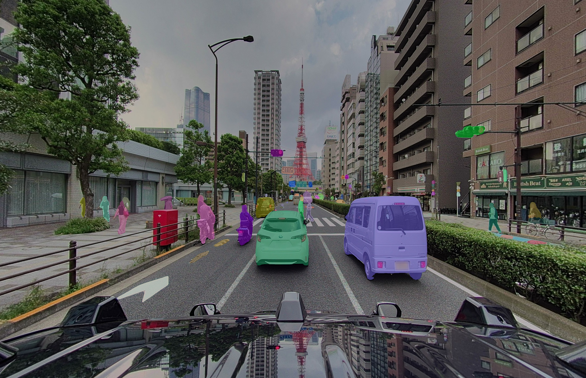

# SAM2 TensorRT C++ Inference

A high-performance TensorRT inference framework for Segment Anything Model 2 (SAM2) implemented in C++, with tools for model conversion from ONNX to TensorRT engine.


## Features

- **High-Performance Inference**: Optimized C++ implementation using TensorRT for fast SAM2 model inference
- **Batch Processing**: Support for batch processing to maximize throughput
- **OpenMP Acceleration**: Multi-threaded processing for CPU tasks using OpenMP
- **Flexible Input**: Process multiple images and bounding boxes in batch
- **Model Precision Options**: Support for FP16 and FP32 precision models
- **CUDA Optimizations**: Efficient GPU memory management with CUDA streams
- **Visualization Tools**: Utilities for visualizing segmentation results

## Prerequisites

### Using Docker (Recommended)
- Docker and NVIDIA Container Toolkit

### Manual Setup
- Ubuntu 22.04
- NVIDIA GPU with CUDA support
- NVIDIA driver (550+)
- CUDA Toolkit (12.3+)
- cuDNN (8.9.7+)
- TensorRT (8.6.1+)
- OpenCV (4.5.4+)
- Boost libraries (1.74.0+)
- CMake (3.10+)

## Environment Setup

### Clone the Repository
```bash
# Clone with submodules
git clone --recursive https://github.com/your-username/sam2_trt_cpp.git

# If you've already cloned without --recursive, run:
git submodule update --init --recursive
```

### Using Docker (Recommended)

Build and run the Docker container:
```bash
cd docker
./build_and_run.sh
```

This script will:
- Build the Docker image with all required dependencies
- Launch a container with GPU support
- Mount the current directory to `/workspace/sam2_trt_cpp` in the container

### Manual Setup

If not using Docker, please refer to the [Prerequisites](#prerequisites) section above for required dependencies.

## Building the Project

```bash
# inside sam2_trt_cpp
cmake -B build
cd build
make
```

## Usage

### Convert models from pytorch to onnx

The repository includes a submodule for converting PyTorch models to ONNX format. To use it:

```bash
# Navigate to the conversion tool directory
cd sam2_pytorch2onnx

# Install dependencies and run conversion
pip install -r requirements.txt
python export_sam2_onnx.py sam2.1_hiera_base_plus /path/to/checkpoint.pt
```

For more details, refer to the [sam2_pytorch2onnx documentation](sam2_pytorch2onnx/README.md).

### Running Inference with pre-generated TensorRT engine

Use the provided script to convert your SAM2 ONNX models to TensorRT format:

```bash
bash tools/generate_encoder_trt.sh path/to/encoder.onnx path/to/encoder.engine [options]
bash tools/generate_decoder_trt.sh path/to/decoder.onnx path/to/decoder.engine [options]
```

Options:
- `--min-batch <N>`: Minimum batch size (default: 1)
- `--opt-batch <N>`: Optimal batch size (default: 128)
- `--max-batch <N>`: Maximum batch size (default: 200)
- `--precision <fp16|fp32>`: Model precision (default: fp16)
- `--workspace <size>`: Workspace size in MB (default: 4096)

The encoder model uses a fixed batch size of 1, while the decoder model's batch size is dynamically configured based on your GPU capabilities and memory constraints.

```bash
./trtsam2 encoder.engine decoder.engine images_folder/ bboxes_folder/ output_folder/ [options]
```

### Running Inference with ONNX model

```bash
./trtsam2 encoder.onnx decoder.onnx images_folder/ bboxes_folder/ output_folder/ [options]
```

#### Command Line Arguments

- `encoder_path`: Path to the encoder TensorRT engine or ONNX model
- `decoder_path`: Path to the decoder TensorRT engine or ONNX model
- `img_folder_path`: Path to the folder containing input images
- `bbox_file_folder_path`: Path to the folder containing bounding box files
- `output_folder_path`: Path to save the segmentation results

#### Options

- `--precision <fp16|fp32>`: Model precision (default: fp32)
- `--decoder_batch_limit <N>`: Maximum batch size for decoder (default: 50)

### Input Format

The bounding box files should be in a text format with each line containing:
```
class_name confidence left top right bottom
```

Where:
- `class_name`: The class name of the object
- `confidence`: Detection confidence score (between 0 and 1)
- `left`: X coordinate of the top-left corner of the bounding box
- `top`: Y coordinate of the top-left corner of the bounding box
- `right`: X coordinate of the bottom-right corner of the bounding box
- `bottom`: Y coordinate of the bottom-right corner of the bounding box

This format is based on the [mAP (mean Average Precision)](https://github.com/Cartucho/mAP) evaluation tool.

### Input File Naming Convention

The image files and their corresponding bounding box files must have matching names (excluding extensions). For example:

```
images_folder/
    ├── image1.jpg
    ├── image2.png
    └── image3.jpeg

bboxes_folder/
    ├── image1.txt
    ├── image2.txt
    └── image3.txt
```

In this example:
- `image1.jpg` corresponds to `image1.txt`
- `image2.png` corresponds to `image2.txt`
- `image3.jpeg` corresponds to `image3.txt`

The program will process each image with its corresponding bounding box file based on the matching names. You can find sample data in the `sample_data` folder to test the inference.

## Benchmarks
- SAM2 base plus model
- 94 target boxes
- "whole" includes engine time, image I/O time, as well as pre-process and post-process time

| Device | Precision | Encoder (ms) | Decoder (ms) | Draw (ms) | Whole (ms) |
|--------|-----------|------------|--------------|--------------|------------|
| L40s | FP32 | 45 | 83 | 15 | 168 |
| L40s | FP16 | 23 | 63 | 13 | 123 |
| RTX 3070ti | FP16 | 60 | 276 | 46 | 414 |
| Jetson Orin | FP16 | 135 | 308 | 93 | 611 |


## License

This project is licensed under the Apache License 2.0

### Dependencies Licenses

- **SAM2**: Licensed under the Apache License 2.0
  - Original repository: [facebookresearch/sam2](https://github.com/facebookresearch/sam2)
  - Copyright (c) Meta Platforms, Inc. and affiliates.

- **argparse**: Licensed under the MIT License
  - Original repository: [p-ranav/argparse](https://github.com/p-ranav/argparse)
  - Copyright (c) 2018 Pranav Srinivas Kumar

## Acknowledgements

- [SAM2 Paper and Original Implementation](https://github.com/facebookresearch/sam2)
- [NVIDIA TensorRT](https://developer.nvidia.com/tensorrt)
- OpenCV community
- [argparse](https://github.com/p-ranav/argparse)
